## how are social bonds forged?

1. **biochemical bonds**: what are the potential neurochemical mechanisms involved in social bonding?
2. <span style="color:green;">**social reward**: what is it about an interaction that makes it feel 'rewarding'? what do we mean when we say that we 'clicked' with someone?</span>
3. **synchrony**: do our brains 'get in sync' when we interact or when we experience things together, and could this be a candidate mechanism?
4. **coexperiences**: why does the same stimulus impact us differently when we experience it together vs alone?
5. **role of communication medium**: why does face-to-face contact seem critically important in establishing lasting and deep social bonds? 

## need to belong

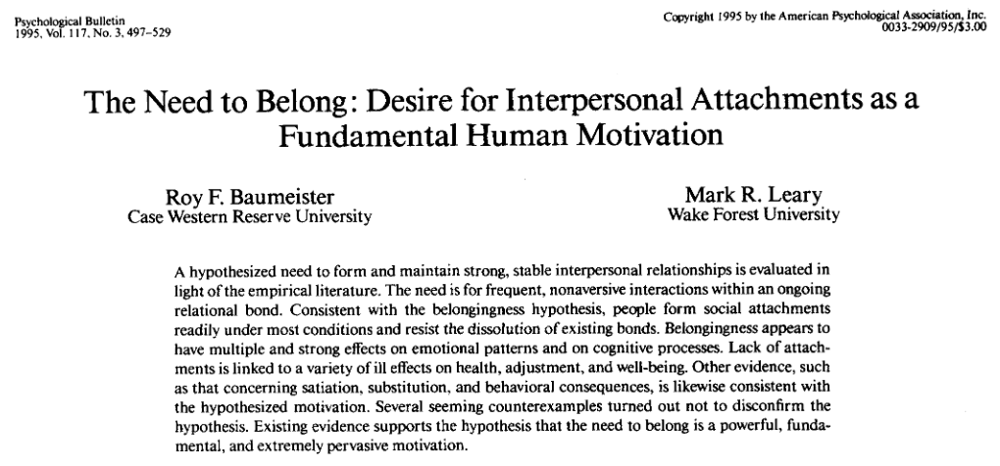{fig-align="center"}

## GUTS: generalized unsafety theory of stress

@Brosschot_Verkuil_Thayer_2018

- stress becomes *chronic* when we don't perceive our environment as safe
- loneliness and rejection put brain on alert (fight or flight)
  - dysregulation of inflammatory response
- positive social experiences / perception of support can turn off stress response
- relationships buffer our responses to stressors
  - e.g., painful stimuli [@Reddan_et-al_2020]

## hormesis

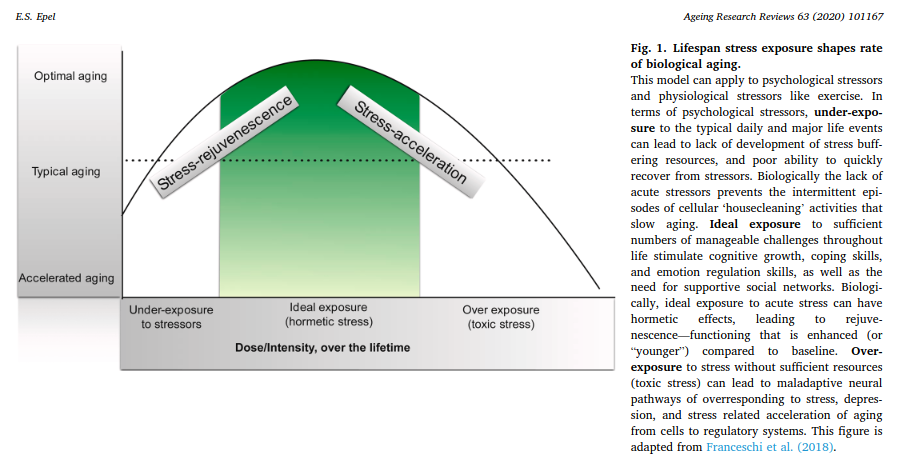{fig-align="center"}

## {background-video="img/cyberball_trim.mp4" background-video-loop="true" background-size="contain"}

::: {.aside}

Prejudice lab, Cyberball <https://www.youtube.com/watch?v=FcyUwCqbctg>.
The Cyberball paradigm was developed by @Williams_et-al_2000

:::

## social rejection in the scanner

@Eisenberger_Lieberman_Williams_2003

Participants played cyberball while in an fMRI scanner, with other (fake) participants on the internet. Told that experiment was about "how people coordinate with one another for simple tasks like ball rolling".

After several minutes, participant was excluded from the tossing.

---

:::: {.columns}

::: {.column width="60%"}

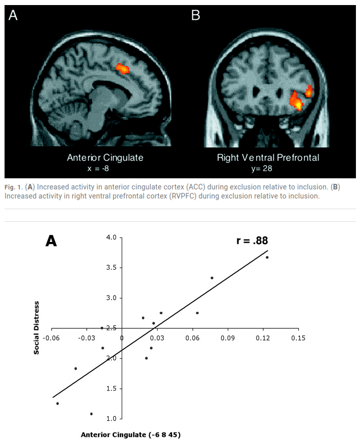{height="600px"}

:::

::: {.column width="40%"}

dACC activation strongly correlated with self-reported distress

*caveat*: ACC activated in many imaging studies, especially those involving some kind of response conflict

:::

::::

## pain and the anterior cingulate cortex (ACC)

[@Lieberman_2015]

:::: {.columns}

::: {.column width="30%"}

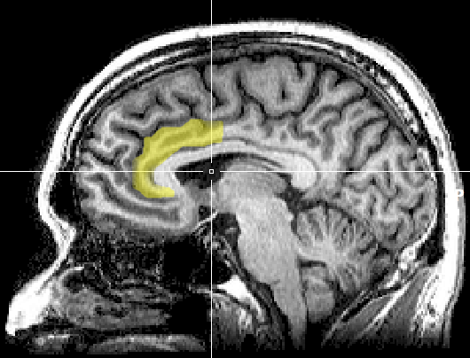

:::

::: {.column width="70%"}

- cingulate (Latin: "belt"): first appears in mammals
- appears to code pain unpleasantness [@Price_2000]
- area of the brain with the highest density of opioid receptors [@Wise_Herkenham_1982]
- cingulectomy patients: feel pain but not *distressed* by it [@Whitty_1955]

:::

::::

## dACC and attachment

- Lesioning of dACC selectively eliminates separation distress vocalizations in squirrel monkeys [@MacLean_Newman_1988]
- Electrically stimulating it in rhesus monkeys elicits distress vocalizations [@Robinson_1967]
- Lesioning it in pregnant rats leads to higher mortality rate for their offspring [@Stamm_1955]

# social bonds are established and maintained through interaction

# a microcosm of social interaction

how to say 'hello'

::: {.notes}

- whether to greet
  - nature of the relationship
    - that person you see in class every day
  - not just the nature of the relationship, but also *context*
    - seeing your instructor walking to/from class
	- seeing your instructor getting changed in the locker room
  - whether a greeting would disrupt others (old friend on Zoom)
- when to greet (other people walking by)
- who to greet (walking in a group)
- level of formality
- how long to greet
  - whether to stop and interact or to move on

:::

# all social interaction

...involves a delicate calculus of *risk* (of rejection) and *reward* (of connection). To reap its *benefits* we must manage its emotional and reputational *costs*

## Delgado et al model of possible mechanisms

![[@Delgado_Fareri_Chang_2023], Fig. 3](img/delgado_et-al_3.png)

- role of synchrony (Lecture 3)
- shared experiences and activities (Lecture 4)

## areas of the brain implicated in social connection

![[@Delgado_Fareri_Chang_2023], Fig. 1](img/delgado_et-al_1.png)


## mentalizing areas of the brain

[@Meyer_2019; @Frith_Frith_2021]

:::: {.columns}

::: {.column width="30%"}

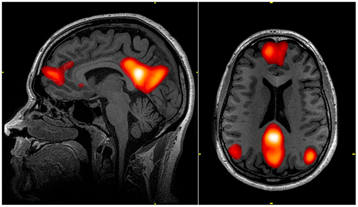

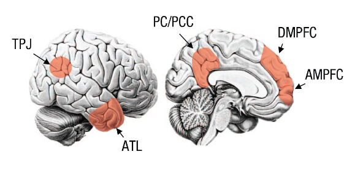

:::

::: {.column width="70%"}

- **medial pre-frontal cortex (mPFC)**: source of top-down signals related to voluntary/controlled action; social judgments
- **temporoparietal junction** and **posterior superior temporal sulcus (TPT / pSTS)**: observation of intentional action; pSTS is part of TPJ and is activated in the perception of biological motion; integration of bottom-up/top-down evidence; prediction errors
- **precuneus / posterior cingulate cortex (PCC)**: visual perspective taking / spatial navigation (perhaps also *social* distance!)

:::

::::

## the default mode network (DMN)


::: {.notes}

- medial prefrontal cortex
- posterior cingulate cortex and precuneus (superior parietal lobe), inner (medial) part of brain
- angular gyrus

:::

## DMN: cause or consequence of social thinking?

- activation in full-term newborns at just two weeks [@Gao_et-al_2009]
- DMN activation shows up within seconds of completion of a math problem [@Spunt_Meyer_Lieberman_2015]
  - primes the 'intentional stance'?

## energy costs of social interaction

@Merolla_Hall_2025

1. How long you talk
2. Who you talk to
3. What you talk about
4. Interest and engagement levels of the conversation
5. Degree of unavoidable or forced socialization
6. Use of communication technology (Lecture 5)
7. Level of familiarity

## self-presentation / impression management

@Goffman_1956

:::: {.columns}

::: {.column width="40%"}

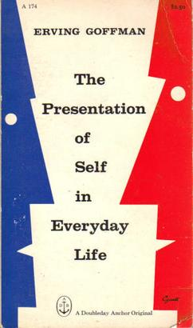

:::

::: {.column width="60%"}
- dramaturgical analysis of social interaction
- interaction reveals individual/mutual assumptions about the nature of the relationship
- avoiding embarrassment (self and other)
- protecting own and others' self-image
:::

::::

::: {.notes}
- one source of demands
:::

## social quiz

{fig-align="center"}

## Compare to @Epley_Schroeder_2014

```{r}
#| label: graph
#| echo: false

library("ggplot2")
library("tibble")

.cxt <- c("waiting room", "train", "airplane", "taxi")

d <- tibble(context = rep(.cxt, each = 2) |>
              factor(levels = .cxt),
            target = rep(c("friend", "stranger"), times = 4),
            percent = c(93, 7, 100, 24, 100, 32, 100, 49))

ggplot(d, aes(context, percent, fill = target)) +
  geom_col() +
  geom_text(aes(label = percent)) +
  facet_wrap(~target) +
  theme_bw() +
  guides(fill = "none")
```

# undersociality

@Epley_et-al_2022

Miscalibrated social cognition creates psychological barriers to connecting with others.

## 

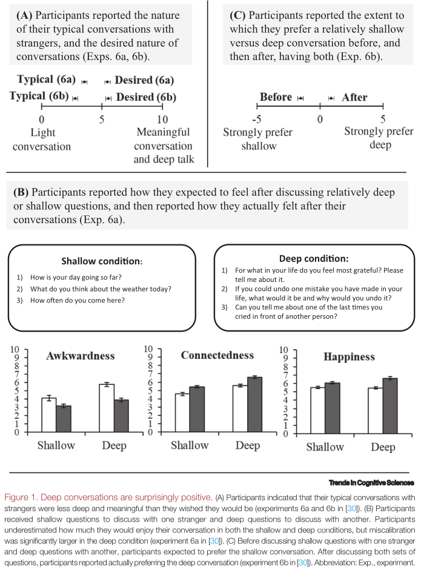

## 

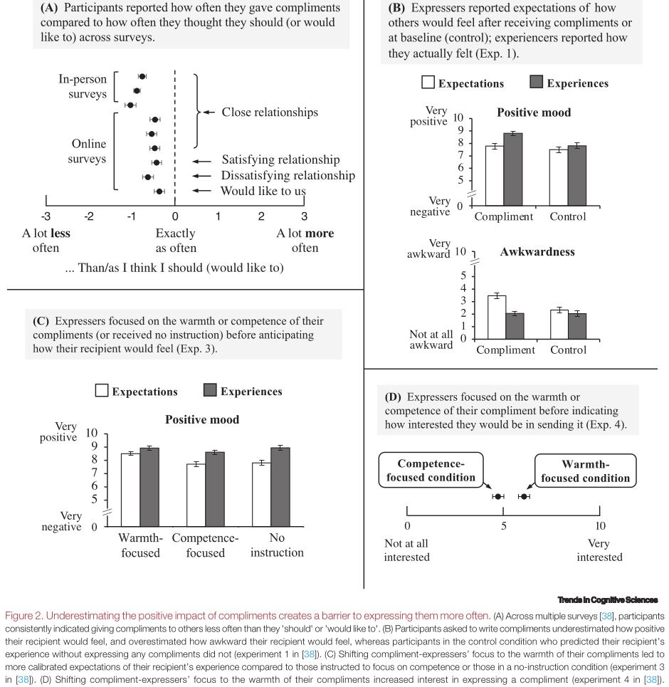

## causes of undersociality?

- **differential construal**: people focus on *competence* when evaluating their own behaviour; *warmth* when evaluating another's
- **uncertain responsiveness**: people underestimate *their own agency* in directing a conversation and thus overestimate the uncertainty about the directions it will go in
- **asymmetric learning**: beliefs that encourage 'approach' will be better calibrated to reality than beliefs that encourage 'avoidance'

# how do bonds form?

## how long to make a friend? [@Hall_2019]

- Data collected using Mechanical Turk ($N=429$) of people who had experienced geographic relocation in last 6 months (>50 miles) 

- Identified a target person they had met since moving and answered questions about their relationship.

- Identified target as best friend, good friend, friend, casual friend, classmate/coworker, friend of friend, acquaintance, specified number of hours spend with them in past weeks, along with feelings of closeness

## {.smaller}

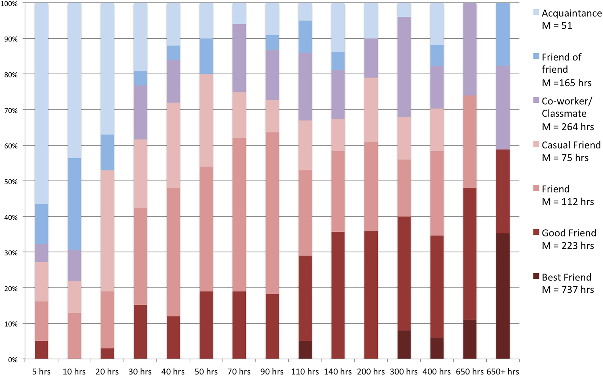

| transition                               | hours      |
|------------------------------------------|------------|
| acquaintance $\rightarrow$ casual friend | ~30 hours  |
| casual friend $\rightarrow$ friend       | ~50 hours  |
| friend $\rightarrow$ good/best friend    | ~140 hours |

## interpersonal chemistry


::: {.notes}
- given the amount of time it takes, choose wisely who we interact with
- chemistry is a *relational* property, an emergent property of interaction that reflects mesh between properties of individuals
:::

## self-disclosure

Humans are possibly unique in the animal kingdom in being strongly motivated to *share the contents of their minds* [@Tomasello_1999]

> The best way to find out if you can trust somebody is to trust them."

Ernest Hemingway


## self-disclosure is rewarding? {.smaller}

@Tamir_Mitchell_2012

:::: {.columns}

::: {.column width="60%"}

![Fig. 1: Neural response during self-disclosure. In addition to robust activity in the MPFC, a whole-brain random-effects contrast comparing self > other trials reveals activity in bilateral NAcc (P < 0.05, corrected) in both (A) study 1a (peak MNI coordinates: −10, 6, −12) and (B) study 1b (peak MNI coordinates: −6, 6, −8; indicated by arrows). (C) A region of interest in bilateral NAcc was independently defined using the Monetary Incentive Delay task (MNI coordinates: 10, 6, −4; −8, 4, −6). (D) Analysis of parameter estimates in this independently defined region confirmed that bilateral NAcc showed significantly greater response during self than during other trials in both studies 1a and 1b. Error bars depict SE calculated for within-subject designs.](img/tamir_mitchell_1.jpg)

::: 

::: {.column width="40%"}
- experiment 1a:
  - cue indicating target:
    - chalk outline of head = self
	- photograph of another person ("fictional, unfamiliar character")
  - phrase ("prefer coffee over tea")
  - Likert scale judgment of how well it described target

- experiment 1b:
  - either disclosed beliefs about own personality traits ('self') or judged traits of another person (US president)
  - "curious" or "ambitious"
  - Likert scale response
:::

::::

## reciprocal self-disclosure promotes liking {.smaller}

@Sprecher_et-al_2013

- pairs in two conditions (N=156), performed two interactions:
- **reciprocal disclosure**: took turns asking and answering questions
- **non-reciprocal**: one discloses, other listens (and then switch roles)

:::: {.columns}

::: {.column width="50%"}

:::

::: {.column width="50%"}

:::

::::

::: {.notes}
interactions took place over video chat

80% female participants

evidence that self-disclosure is more important in friendship between females, while friendships between males tend to focus on activities and companionship
:::

## social penetration theory

Irwin Altman & Dalmas Taylor [@Altman_Taylor_1973; @Altman_Vinsel_Brown_1981]

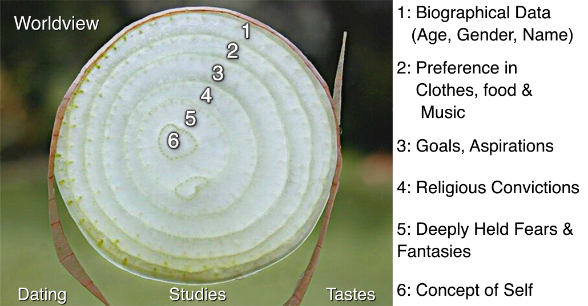

## stages of social penetration

1. orientation
2. exploratory-affective
3. affective
4. stable
5. de-penetration (optional)

::: {.notes}
Altman and Taylor: social penetration moves quickly in the beginning stages of a relationship and slows down in later stages

1. orientation: individuals engage in small talk and simple, harmless clichés like, 'Life's like that'. This first stage follows the standards of social desirability and norms of appropriateness.[1] The outer images are presented and peripheral information are exchanged. The most, but least intimate information is given here.[19]

2. exploratory-affective: ndividuals start to reveal the inner self bit by bit, expressing personal attitudes about moderate topics such as government and education. This may not be the whole truth as individuals are not yet comfortable to lay themselves bare. This is the stage of casual friendship

3. The affective stage: individuals are getting more comfortable to talk about private and personal matters, and there are some forms of commitment in this stage. Personal idioms, or words and phrases that embody unique meanings between individuals, are used in conversations. Criticism and arguments may arise. A comfortable share of positive and negative reactions occur in this stage. Relationships become more important, meaningful, and enduring to both parties. It is a stage of close friendships and intimate partners.[9]

4. The stable stage: the relationship now reaches a plateau in which some of the deepest personal thoughts, beliefs, and values are shared and each can predict the emotional reactions of the other person. This stage is characterized with complete openness, raw honesty and a high degree of spontaneity.[9] The least, but most intimate information is given here.[19]

5. De-penetration stage (optional): when the relationship starts to break down and costs exceed benefits, there is a withdrawal of disclosure that causes the relationship to end.
:::

## key ideas {.smaller}

- humans have a fundamental *need to belong*: frequent, positive bonded interactions
- good relationships buffer us against insecurity and chronic stress
- *hormesis* (good stress) is an optimal level of stress that promotes growth & change
- social rejection activates dACC, a brain area associated with physical pain (know properties of dACC)
- social interaction is fundamental for social connection
  - involves *risk* and *reward*
- social interaction heavily draws on mentalising brain areas (know them)
- mentalising areas overlap with default mode network (DMN)
- miscalibrated social cognition creates barriers to connection (undersociality) due to differential construal, uncertain responsiveness, asymmetric learning
- establishing friendship requires heavy time investment (~50 hours)
- choice of who to befriend depends on estimated rewards/chemistry
- interpersonal chemistry is an *emergent* property of interaction
- self-disclosure is key to deepening relationships, especially if it is reciprocated
- stages of social penetration theory

# references {.smaller}

::: {#refs}
:::
